# 🏭 Smart Factory Intelligence — Multi-Agent Manufacturing PoC

A production-quality demo showcasing **multi-agent AI orchestration** for manufacturing using Microsoft Agent Framework, Azure AI Foundry, and the AG-UI protocol.

Built for customer workshops to demonstrate how AI agents can assist with demand forecasting, quality control, and supply chain management in food manufacturing.

   

---

## What This Demonstrates

| Feature | What the customer sees |
|---|---|
| **Multi-Agent Orchestration** | An Orchestrator agent delegates to 3 specialists (Demand, Quality, Supply Chain) — visible in real-time in the Agent Hub |
| **Tool Calling** | Agents query databases, search documents, call SAP — every tool call is streamed to the Agent Activity feed |
| **Human-in-the-Loop Pipeline** | A step-by-step production analysis pipeline with approve/reject gates at each checkpoint |
| **MCP / SAP Integration** | Mock SAP S/4HANA OData tools show how MCP servers connect enterprise systems to agents |
| **RAG** | Quality agent searches embedded SOPs and HACCP documents via vector search |
| **Azure AI Foundry** | All models (GPT-5, GPT-5-mini, text-embedding-large) deployed in Foundry |
| **AG-UI Protocol** | Real-time agent streaming via Server-Sent Events, consumed by CopilotKit |

---

## Architecture

```mermaid
graph TB
    subgraph Frontend["Frontend (Next.js 15 + CopilotKit)"]
        direction TB
        UI["Dashboard UI<br/>KPIs · Charts · Pipeline"]
        Chat["CopilotKit Chat<br/>AG-UI Streaming"]
        Hub["Agent Hub<br/>Orchestration Viz · Activity Feed"]
        Proxy["/api/copilotkit<br/>CopilotRuntime Proxy"]
    end

    subgraph Backend["Backend (Python · FastAPI)"]
        direction TB
        AGUI["AG-UI Endpoint<br/>/agent SSE"]
        API["Dashboard API<br/>/api/dashboard"]
        Pipeline["HITL Pipeline<br/>/api/pipeline/easter-rush"]
        Events["Events Stream<br/>/api/events/stream SSE"]
    end

    subgraph Orchestrator["Manufacturing Orchestrator"]
        ORC["Orchestrator Agent<br/>GPT-5"]
    end

    subgraph Specialists["Specialist Agents"]
        direction LR
        Demand["Demand Forecaster<br/>GPT-5"]
        Quality["Quality Inspector<br/>GPT-5"]
        Supply["Supply Chain Mgr<br/>GPT-5-mini"]
    end

    subgraph Tools["Function Tools - tracked_tool"]
        direction LR
        SalesTools["Sales Tools<br/>query_sales_history<br/>get_seasonal_forecast<br/>compare_year_over_year"]
        QualityTools["Quality Tools<br/>get_quality_metrics<br/>detect_anomalies<br/>search_quality_docs"]
        SupplyTools["Supply Tools<br/>check_inventory<br/>get_reorder_alerts<br/>calculate_material_needs"]
        SAPTools["SAP MCP Tools<br/>sap_get_production_orders<br/>sap_get_material_master<br/>sap_get_stock_overview"]
    end

    subgraph Data["Data Layer"]
        direction LR
        DB[("SQLite<br/>27 products · 21K+ sales<br/>5 lines · 15 materials")]
        Docs["Quality Docs<br/>SOPs · HACCP Plans<br/>RAG / Embeddings"]
    end

    subgraph Foundry["Azure AI Foundry"]
        direction LR
        GPT5["GPT-5"]
        GPT5Mini["GPT-5-mini"]
        Embed["text-embedding-large"]
    end

    UI --> API
    Chat --> Proxy
    Hub --> Events
    Proxy --> AGUI
    AGUI --> ORC
    Pipeline --> Demand
    Pipeline --> Quality
    Pipeline --> Supply
    ORC -->|"tool call"| Demand
    ORC -->|"tool call"| Quality
    ORC -->|"tool call"| Supply
    Demand --> SalesTools
    Quality --> QualityTools
    Supply --> SupplyTools
    Supply --> SAPTools
    SalesTools --> DB
    QualityTools --> DB
    QualityTools --> Docs
    SupplyTools --> DB
    SAPTools --> DB
    ORC -.->|"API"| GPT5
    Demand -.->|"API"| GPT5
    Quality -.->|"API"| GPT5
    Supply -.->|"API"| GPT5Mini
    Docs -.->|"embed"| Embed
    Demand -->|"push_event"| Events
    Quality -->|"push_event"| Events
    Supply -->|"push_event"| Events
```



<details>
<summary>Text-based architecture (for terminals without Mermaid support)</summary>

```
Frontend (Next.js 15 + CopilotKit + shadcn/ui)
  ├── Dashboard Tab: KPIs, revenue/volume charts, inventory, quality monitor
  ├── Agent Hub Tab: Chat, orchestration viz, live activity feed
  ├── Pipeline: HITL multi-step analysis with approve/reject
  └── Connected Tools Panel: MCP servers & function tools status
          │
          │ /api/copilotkit (CopilotRuntime proxy)
          ▼
Backend (Python 3.12 + FastAPI + agent-framework)
  ├── /agent (AG-UI)   → Orchestrator SSE streaming
  ├── /api/dashboard   → KPIs, charts, quality data
  ├── /api/pipeline    → HITL pipeline SSE streaming
  ├── /api/events      → Agent activity event stream
  │
  ├── agents/
  │   ├── orchestrator → Uses specialists via agent.run()
  │   ├── demand       → GPT-5 + sales tools
  │   ├── quality      → GPT-5 + quality tools + RAG
  │   └── supply_chain → GPT-5-mini + supply + SAP tools
  │
  ├── tools/ (all tracked with real-time events)
  │   ├── sales_tools     → query_sales_history, forecasts, YoY
  │   ├── quality_tools   → metrics, anomaly detection, SOP search
  │   ├── supply_tools    → inventory, reorder, material needs
  │   └── sap_mcp_tools   → Mock SAP OData (orders, materials, stock)
  │
  └── database/manufacturing.db (SQLite, 21K+ records)
          │
Azure AI Foundry
  ├── GPT-5 / GPT-5-mini (chat + reasoning)
  └── text-embedding-large (RAG)
```

</details>

---

## Quick Start

### Prerequisites

- Python 3.12+
- Node.js 20+
- An [Azure AI Foundry](https://ai.azure.com) project with deployed models
- Azure CLI logged in (`az login`)

### 1. Clone & setup backend

```bash
git clone <this-repo>
cd manufacturing-demo

# Create Python virtual environment
python -m venv .venv
# Windows
.venv\Scripts\Activate.ps1
# macOS/Linux
source .venv/bin/activate

# Install dependencies
pip install -e backend/ --pre
```

### 2. Configure environment

```bash
cp .env.example .env
# Edit .env with your Azure AI Foundry endpoint and model deployment names
```

Required variables:
```
AZURE_AI_PROJECT_ENDPOINT=https://your-project.services.ai.azure.com/
AZURE_OPENAI_DEPLOYMENT_NAME=gpt-5          # or gpt-4o, gpt-4.1, etc.
AZURE_OPENAI_MINI_DEPLOYMENT_NAME=gpt-5-mini # or gpt-4o-mini
AZURE_OPENAI_EMBEDDING_DEPLOYMENT_NAME=text-embedding-large
```

### 3. Seed the database

```bash
python backend/database/seed.py
```

This creates `backend/database/manufacturing.db` with:
- 27 confectionery products (chocolate, gummies, marzipan, seasonal)
- 21,000+ sales records across 24 months with seasonal patterns
- 5 production lines with quality metrics
- 15 raw materials, 10 suppliers
- 13 production orders (active, planned, completed)
- 6 quality documents (SOPs, HACCP plans)

### 4. Start the backend

```bash
# From project root
uvicorn backend.main:app --reload --port 8000
```

### 5. Setup & start the frontend

```bash
cd frontend
npm install
npm run dev
```

### 6. Open the app

Navigate to **http://localhost:3000**

---

## Demo Walkthrough

### Tab 1: Dashboard

1. **KPI Cards** — Active production, quality score, inventory alerts, revenue
2. **Sample Data Overview** — Shows the dummy data powering the demo (27 products, 21K+ sales records, etc.)
3. **Revenue & Volume Trend** — 24-month dual-axis chart showing seasonal peaks (Easter, Christmas)
4. **Pipeline Analysis** — Click "Run Easter Rush Analysis" to launch the HITL pipeline:
   - Demand agent checks commitments → Supply chain checks materials → Quality checks lines → Executive summary
   - Approve or reject at each step
5. **Inventory & Quality** — Stock levels with reorder line, live quality monitor with clickable warnings
6. **Production Orders** — Active, planned, and completed orders with status/priority

### Tab 2: Agent Hub

1. **AI Agent Chat** — Direct conversation with the Orchestrator
2. **Agent Orchestration** — Visual tree showing Orchestrator → 3 specialists with live status (Idle/Active/Done)
3. **Agent Activity** — Real-time event feed showing:
   - Agent start/end with timing
   - Individual tool calls (`query_sales_history`, `check_inventory`, `sap_get_production_orders`...)
   - Tool results with data previews
   - Color-coded by agent (blue = Demand, green = Quality, amber = Supply Chain)

### Suggested Demo Prompts

| Prompt | What it shows |
|---|---|
| "200K Easter bunnies by April — can we deliver?" | Multi-agent orchestration: all 3 agents invoked |
| "Quality on Chocolate Line 2?" | Quality agent + anomaly detection + SOP search |
| "Which materials need reordering?" | Supply chain + SAP integration |
| "Christmas 2024 vs 2025 trends?" | Demand agent + historical data analysis |
| Click "→ Investigate" on a quality warning | Automatic agent investigation from dashboard |

---

## Customization

### Using different models

Edit `.env` to use any models deployed in your Foundry project. The system works with GPT-4o, GPT-4.1, GPT-5, or any chat completion model.

### Adapting for a different industry

1. **Products & data**: Modify `backend/database/seed.py` — change product catalog, categories, seasonal patterns
2. **Agent instructions**: Edit the instruction strings in `backend/agents/demand.py`, `quality.py`, `supply_chain.py`
3. **Tools**: Modify functions in `backend/tools/` to match industry-specific queries
4. **Quality documents**: Update the `QUALITY_DOCUMENTS` list in `seed.py` with domain-relevant SOPs

### Adding new agents

1. Create `backend/agents/your_agent.py` following the pattern in `demand.py`
2. Add tool functions in `backend/tools/your_tools.py` with `@tracked_tool("YourAgent")` decorator
3. Register the agent in `backend/agents/orchestrator.py` as a new `@tool` wrapper
4. Update the Agent Hub visualization in `frontend/src/components/agent-hub/agent-hub.tsx`

---

## Tech Stack

| Layer | Technology | Purpose |
|---|---|---|
| **Agent Framework** | [Microsoft Agent Framework](https://learn.microsoft.com/agent-framework/) | Multi-agent orchestration, tool calling |
| **AI Models** | Azure AI Foundry (GPT-5, GPT-5-mini) | LLM reasoning |
| **Protocol** | [AG-UI](https://docs.ag-ui.com/) | Agent-to-UI streaming via SSE |
| **Frontend Runtime** | [CopilotKit](https://copilotkit.ai) | React chat UI + AG-UI bridge |
| **Backend** | FastAPI + aiosqlite | REST APIs + async database |
| **Frontend** | Next.js 15 + React 19 + shadcn/ui | Dashboard UI |
| **Charts** | Recharts | Revenue trends, inventory levels |
| **Database** | SQLite | Zero-infrastructure demo data |

---

## Project Structure

```
├── backend/
│   ├── main.py                 # FastAPI app, AG-UI endpoint, CORS
│   ├── config.py               # Foundry endpoint, model config
│   ├── agents/
│   │   ├── orchestrator.py     # Orchestrator (delegates to specialists)
│   │   ├── demand.py           # Demand Forecasting agent
│   │   ├── quality.py          # Quality Control agent + RAG
│   │   ├── supply_chain.py     # Supply Chain agent
│   │   └── events.py           # Global activity event bus
│   ├── tools/
│   │   ├── sales_tools.py      # Sales queries (@tracked_tool)
│   │   ├── quality_tools.py    # Quality metrics + doc search
│   │   ├── supply_tools.py     # Inventory + supplier tools
│   │   ├── sap_mcp_tools.py    # Mock SAP S/4HANA OData
│   │   └── tracking.py         # @tracked_tool decorator
│   ├── api/
│   │   ├── dashboard.py        # KPI, charts, events stream
│   │   └── pipeline.py         # HITL pipeline SSE endpoint
│   └── database/
│       ├── schema.sql          # SQLite schema (8 tables)
│       ├── seed.py             # Dummy data generator
│       └── connection.py       # Async DB connection
├── frontend/
│   ├── src/app/
│   │   ├── layout.tsx          # CopilotKit provider
│   │   ├── page.tsx            # Dashboard + Agent Hub tabs
│   │   └── api/copilotkit/     # CopilotRuntime proxy route
│   ├── src/components/
│   │   ├── dashboard/          # KPI cards, charts, data overview
│   │   ├── chat/               # CopilotKit chat integration
│   │   ├── pipeline/           # HITL pipeline analysis
│   │   ├── agent-hub/          # Agent orchestration + activity
│   │   └── tools-panel/        # Connected Tools display
│   └── src/lib/api.ts          # Dashboard API client
├── .env.example                # Environment template
├── .gitignore
├── AGENTS.md                   # Development guidelines
└── README.md                   # This file
```

---

## License

MIT
